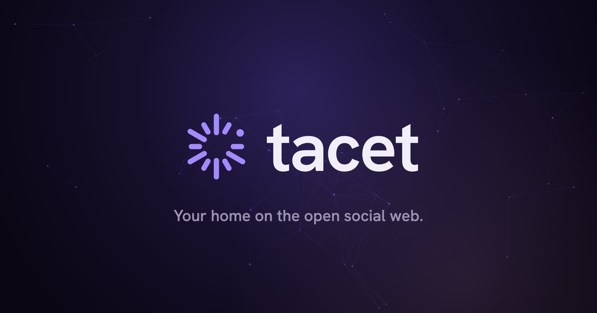

<p align="center">
  
</p>

# Tacet

**Your home on the open social web.**

An open-source social platform built around people, not platforms.
Powered by open protocols. Designed as one coherent product.

> People before posts.
> Relationships before engagement.
> Identity before platforms.
> Calm before addiction.
> Open before closed.

> ⚠️ **Early development — not ready for production use.** Tacet is a work in
> progress. Much of the app currently runs on mock data. Expect rough edges, moving
> parts, and breaking changes. See [Current status](#current-status).

---

## What is Tacet?

Tacet is one calm place for your social life on the open web.

Today you keep several apps to stay in touch with the same people. Each owns a
different sliver of your identity, holds a different inbox, runs a different
algorithm, and answers to a different company. You do the work of stitching them
together. Nobody set out to build that — it's just what happens when every network
becomes a walled garden.

Tacet is the single, calm window back into all of it: one identity you own, one
place your people live, one door to the wider open social web.

**Tacet is a complete product, not a Fediverse client.** Think of it the way Gmail
is a product built on email: the protocol underneath is open and decentralized, but
what you experience is one beautiful, coherent thing. ActivityPub is how Tacet reaches
the open social web — an implementation detail at the edge, never the product itself.

> Open protocols. Closed silos. Beautiful products.
> Users deserve all three. Tacet exists to prove they can coexist.

## Product philosophy

Tacet is built on five commitments and organized around five permanent pillars.

**The five commitments** (see [`FOUNDING_PRINCIPLES.md`](FOUNDING_PRINCIPLES.md)):
people before posts · relationships before engagement · identity before platforms ·
calm before addiction · open before closed.

**The five pillars** — the frozen product model. Every feature must strengthen one:

| Pillar | What it is |
|---|---|
| **Today** | The calm entry point. A finite, curated-feeling stream — not an endless feed. |
| **People** | Your relationships, wherever on the open web they live. |
| **Discover** | The gateway to the wider open social web. |
| **Conversations** | Correspondence, not anxiety-based notifications. |
| **Me** | Your identity and your own place. Owned, portable. |

What Tacet is **not**: not a Twitter/X clone, not an Instagram clone, not a Mastodon
frontend, not a thin ActivityPub wrapper. It **begins with the open social web** —
the ActivityPub-compatible platforms (Mastodon, Pixelfed, PeerTube, WriteFreely,
Friendica). It does **not** claim to connect to closed networks (Instagram, X,
TikTok, LinkedIn, YouTube); those stay walled until they open a door, and we say so
plainly.

## Repository structure

```txt
docs/                Product, design, and engineering documentation (start here).
  00-manifesto/        Why Tacet exists.
  01-product/          The five-pillar information architecture.
  02-human-interface-guidelines/
  03-design-system/    Tokens, type, spacing, components (the visual source of truth).
  04-user-journeys/
  05-federation/       ActivityPub as a replaceable adapter — an implementation detail.
  06-engineering/      Architecture direction, domain model, adapter design.
  07-brand/  08-roadmap/

client/              React + TypeScript single-page app (the product UI).
  src/design/          Design system: theme tokens (light + dark), primitives, icons.
  src/app/             The five pillars + app shell (currently on mock data).
  src/views/           Landing page and sign-in.
  src/legacy/          The old "rooms" product — quarantined and dormant (not shipped).

src/                 Cloudflare Worker (Hono API, TypeScript).
migrations/          Cloudflare D1 (SQLite) schema, append-only.

FOUNDING_PRINCIPLES.md   The pillars, the commitments, the adapter law.
PRODUCT_DIRECTION.md     Where Tacet is going; legacy assumptions being retired.
DEPLOY.md                Self-hosting guide (optional; deploy to your own account).
```

> Note: [`docs/06-engineering/`](docs/06-engineering/) describes a *target*
> `apps/` + `packages/` layout to grow into. The structure above is what exists today.

## Documentation map

- **[docs/00-manifesto/](docs/00-manifesto/)** — why Tacet exists. Start here.
- **[docs/01-product/](docs/01-product/)** — the five-pillar product model.
- **[docs/03-design-system/](docs/03-design-system/)** — the visual source of truth.
- **[docs/05-federation/](docs/05-federation/)** — federation as an implementation
  detail (the product would still make sense if the protocol were replaced).
- **[FOUNDING_PRINCIPLES.md](FOUNDING_PRINCIPLES.md)** / **[PRODUCT_DIRECTION.md](PRODUCT_DIRECTION.md)** — the one-page canon.

## Development setup

Requires Node 20+. **No Cloudflare account or secrets are needed for local
development** — D1 and R2 are simulated by `wrangler dev`.

```sh
npm install
npm run migrate      # apply D1 migrations to a simulated local database
npm run dev          # build the SPA + run the Worker at http://localhost:8787
```

The five-pillar app runs on mock data and is walkable without signing in — open
**http://localhost:8787/today**. Toggle light/dark from the app.

Checks:

```sh
npm run typecheck    # tsc project-references
npm run build        # Vite production build
npm test             # Vitest (API + auth)
```

Local secrets (only if you deploy) go in a git-ignored `.dev.vars` — copy
[`.dev.vars.example`](.dev.vars.example). Self-hosting to your own Cloudflare account
is documented in [`DEPLOY.md`](DEPLOY.md).

## Current status

Tacet is **early and pre-production.**

- ✅ The five-pillar UI (Today / People / Discover / Conversations / Me), a landing
  page, sign-in, and a light/dark design system — built and running.
- 🧪 The app currently renders **mock data**. Reading live data from the open social
  web through the adapter layer is the next milestone.
- 🚧 No federation, messaging, notifications, or realtime yet — these are documented
  as direction, not shipped.
- 🗄️ A legacy "rooms" product from an earlier phase is quarantined in
  `client/src/legacy/` (dormant, not shipped).

See [`PRODUCT_DIRECTION.md`](PRODUCT_DIRECTION.md) and [`STATE.md`](STATE.md) for the
detailed picture.

## Roadmap

- **Now → next:** read-only open social web — Today and People reading live public
  data through the adapter, so Tacet feels alive on day one.
- **Then:** compose/publish, conversations, richer discovery.
- **Later:** deeper (write) federation, portability you can feel, native surfaces.

Details in [docs/08-roadmap/](docs/08-roadmap/).

## Contributing

Contributions are welcome once the project opens up — start with
[`CONTRIBUTING.md`](CONTRIBUTING.md) and the [`CODE_OF_CONDUCT.md`](CODE_OF_CONDUCT.md).
The one rule: every change should strengthen one of the five pillars.

Security issues: please report privately — see [`SECURITY.md`](SECURITY.md).

## License

Tacet is intended to be released under the **GNU AGPL-3.0** (recommended default,
pending final founder sign-off). See [`LICENSE`](LICENSE).

---

*Tacet is a VNTA Group venture — [tacet.social](https://tacet.social).*
